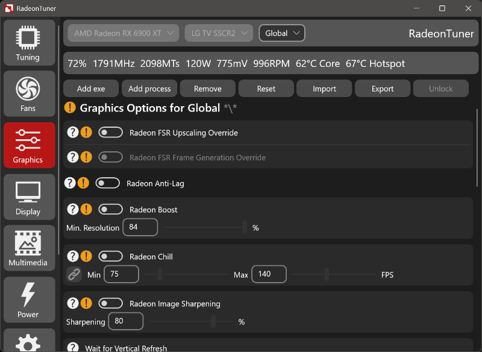

## Application Description
RadeonTuner is an easy to use alternative for the AMD Adrenalin Software for users that just want the basics or use the driver only install type.

## Application Features
- Automatically reapply tuning settings on driver resets.
- Import and export your settings to a file.
- Change gpu and fan tuning settings.
- Change gaming graphic settings.
- Change your display settings.

## Installation Instructions
1) Extract the RadeonTuner folder to any directory you want on your device.
2) Make sure that you have installed all the requirements listed below.
3) Run the RadeonTuner executable file.

## Uninstallation Instructions
1) Remove the extracted RadeonTuner folder.

## Tips and tricks
- When installing your AMD drivers you can choose 'Driver Only' install type.
- You can show the window on top by enabling it on the settings tab.

## Requirements
- Supported AMD Radeon graphics card and drivers.
- Microsoft Visual C++ Redistributable installed.
- Microsoft .NET Runtime installed.
- Microsoft Windows 10 or higher is required.

## Known Issues
- Bug in AMD ADLX SDK returns wrong clock values on some videocards.

## Support and bug reporting
When you are walking into any problems or a bug you can go to my help page at https://help.arnoldvink.com so I can try to help you out and get everything working.

## Developer donation
If you appreciate my projects and want to support me you can make a donation at https://donation.arnoldvink.com

## Changelog
v0.7.0.0 (17-December-2025)
- Added Radeon FSR 4 (ML Redstone) override graphics setting.
- Added application updater to easily install updates.

v0.6.0.0 (9-December-2025)
- Added option to add RadeonTuner to start menu.
- Added option to add RadeonTuner to desktop context menu.
- Show application window when it is already running in background.
- Added keep active support for multiple videocards.
- Added administrator setting hint icons.

v0.5.2.0 (28-November-2025)
- Added AFMF Fast Motion Response setting.

v0.5.0.0 (12-November-2025)
- Added setting to launch application on windows startup.

v0.4.0.0 (31-October-2025)
- Added registry based graphics settings.

v0.3.0.0 (12-September-2025)
- Updated design to be more clear.
- Added more graphics options.

v0.1.0.0 (11-June-2025)
- First official beta test release.
