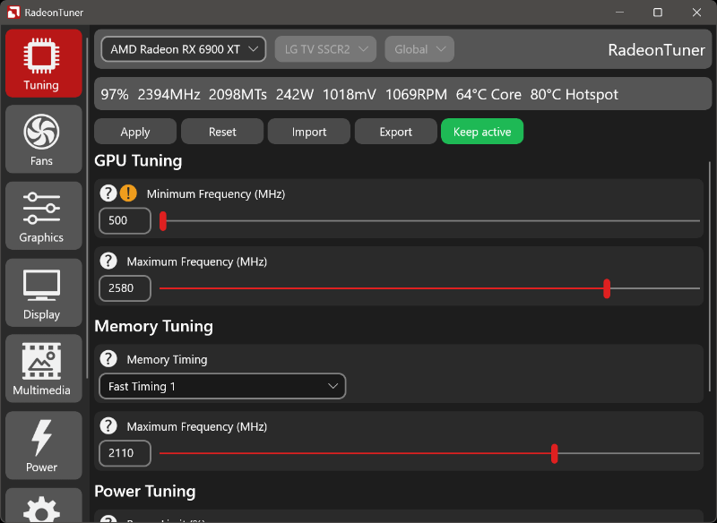
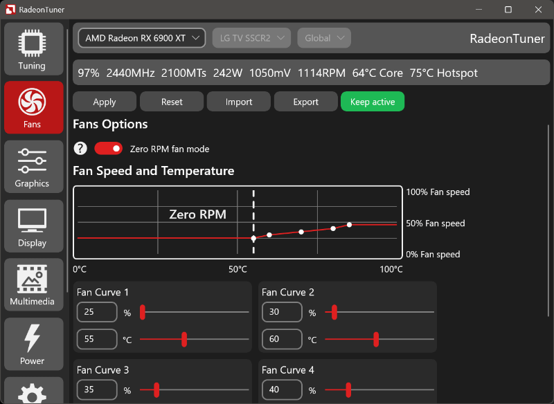

## Application Description
AMD Driver Tool is an easy to use alternative for the AMD Adrenaline Software for users that just want to basics and use the driver only install type.
- This is a beta test release so things may not always work properly.

## Application Features
- Change gaming graphic settings.
- Change GPU tuning and fan settings.
- Change your display settings.

## Installation Instructions
1) Extract the AmdDriverTool folder to any directory you want on your device.
2) Make sure that you have installed all the requirements listed below.
3) Run the AmdDriverTool executable file.

## Uninstallation Instructions
1) Remove the extracted AmdDriverTool folder.

## Tips and tricks
- When installing your AMD drivers you can choose 'Driver Only' install type.
- You can show the window on top by clicking on the pin button.

## Requirements
- Supported AMD Radeon graphics card and drivers.
- Microsoft Visual C++ Redistributable installed.
- Microsoft Windows 11 64-bit or higher is required.

## Known Issues
- None

## Support and bug reporting
When you are walking into any problems or a bug you can go to my help page at https://help.arnoldvink.com so I can try to help you out and get everything working.

## Developer donation
If you appreciate my projects and want to support me you can make a donation at https://donation.arnoldvink.com

## Changelog
v0.1.0.0 (?-June-2025)
- First official beta test release.